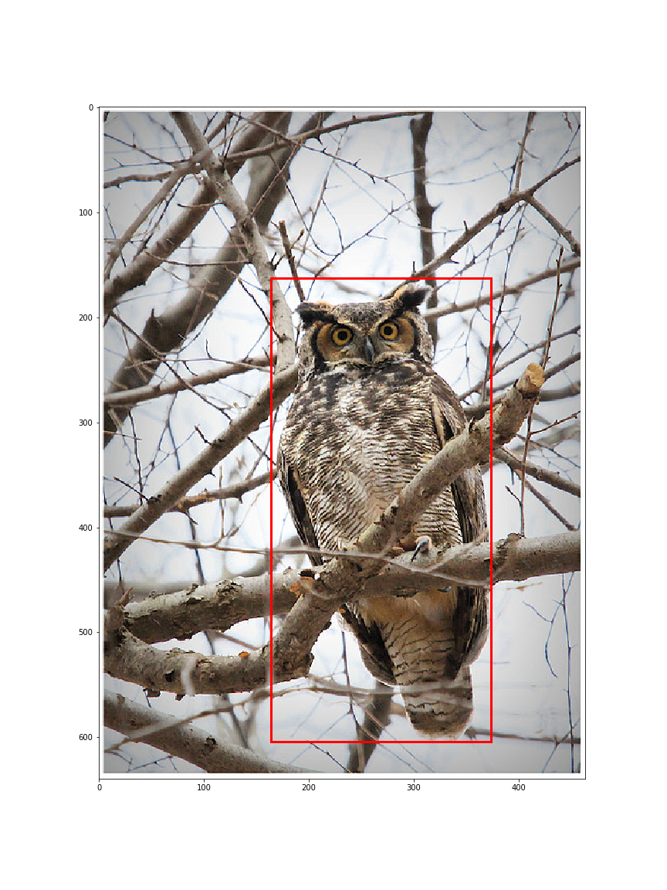

# Plover Bird ID
*To identify birds that we amateur bird watchers and photographers do not know.*

## Background
As an amateur bird photographer, the question I ask myself looking at a photo is, "What is this bird?" It turns out there are many people with the same issue. That's why I decided to construct a model to identify birds.

## Determining the Goal
I take bird pictures and go home to edit them using my laptop. If I want to know what bird it is I would upload it to a web app for recognition. Another very similar app im functionality is the Merlin mobile app developed by Cornell Lab of Ornithology (CLO). It is a great (and official?) app, but taking a picture of my photo with my phone is kind of tedious. So the goal is to **build a web app for bird IDing**, ideally with cropping (as birds are usually small in a photo) and geospatial refinement.

## Research
I did a little research, reading two papers on (1) [How the Merlin App was built][1], and (2) [Whether to train the model from scratch][2], discovering the [NAbirds][3] and the [CUB-200-2011][4] datasets, and finally finding a similar web app implementation by [lzbdr][5]. It is particularly clear from paper 2 and the lzbdr implementation that it is quite hard to start training a convolutional neural network (CNN) from scratch. Rather, a pretrained model such as MobileNet V2 is used as the base.

[1]:https://vision.cornell.edu/se3/wp-content/uploads/2015/05/Horn_Building_a_Bird_2015_CVPR_paper.pdf
[2]:http://www.bmva.org/bmvc/2014/files/paper071.pdf
[3]:http://dl.allaboutbirds.org/nabirds
[4]:http://www.vision.caltech.edu/visipedia/CUB-200-2011.html
[5]:https://github.com/shaneopatrick/lzbdr

## The NAbirds dataset and data preprocessing
Here I am going to use the NAbirds dataset, which contains 48,562 images with bounding boxes of 404 bird species, each with at least 100 images. The class is further divided into 555 "visual categories.[^1]" A visual category represents a form (e.g. breeding, (fe)male, juvenile, etc.) of the bird. The dataset also contains part annotations like where eyes, wings, legs, etc. are. I did not use these as it is quite unreasonable to ask the user to input the information.

Combining all information provided, we have an overview for a photo:



```plain
image_id                      00903263-7ea9-49bd-8c4e-934ab87006ee
image_name               0539/009032637ea949bd8c4e934ab87006ee.jpg
bb_x                                                           164
bb_y                                                           163
bb_width                                                       210
bb_height                                                      441
class_id                                                       539
photographer                                           Ryan_Schain
class_name                                        Great_Horned_Owl
image_file                00903263-7ea9-49bd-8c4e-934ab87006ee.png
class_id_sp                                                    539
class_name_sp                                     Great_Horned_Owl
image_name_sp            0539/009032637ea949bd8c4e934ab87006ee.jpg
image_name_fname_only         009032637ea949bd8c4e934ab87006ee.jpg
```


### Class hierarchy
One particular thing about the dataset is that the different visual categories are labeled with different class_id. Since some of these categories contain few images, I decided to combine all of them into a class that belongs to a species. 
With the dataset a class_id hierarchy list is provided. For example, for Wood Ducks the list looks like this:

[314, 81] **Wood Duck (Breeding male)** belongs to **Wood Duck** <br/>
[613, 81] **Wood Duck (Female/Eclipse male)** belongs to **Wood Duck**<br/>
[81, 1] **Wood Duck** belongs to **Ducks, Geese, and Swans**<br/>
[1, 0] **Ducks, Geese, and Swans** belongs to **Birds**<br/>

Instead of having class_id 314 or 613, I want to combine them into class_id 81. Noticing the subspecies category all have parentheses associated with the class names, I stored the class_id at species level in a class_id_sp label. These will be the labels we try to fit our CNN model with.

### Image cropping
Image cropping is pretty simple. With cv2, I cropped the image based on the bounding box info. If the box is not square, I padded black sides. These images are saved as 400 \* 400 pixel images in directories named after class_id_sp. I randomly assigned these files to test, val, and test folders. I think this step can be optimized in the future.

Original image                     |  Cropped image
:-------------------------:|:-------------------------:
  |     


## Training the CNN
The entire cropped image set is uploaded to Google Drive and training done on Google Colab with GPU. I started with a MobileNet V2 model, added a 2D pooling and finally a softmax Dense layer as output.

```python
base_model = tf.keras.applications.MobileNetV2(input_shape=IMG_SHAPE,
                                               include_top=False, 
                                               weights='imagenet')
base_model.trainable = False
global_average_layer = tf.keras.layers.GlobalAveragePooling2D()
prediction_layer = keras.layers.Dense(404,activation='softmax')
```

The first 10 epochs are trained with the ``base_model`` as the feature extractor. The next 20 epochs are with the final 55 layers of the base_model trainable. The training resulted in undesirable overfitting - I guess one simply needs more data to resolve this. 

 

The images are not loaded into the memory (I don't have enough). Instead it is generated through ``keras.preprocessing.image.ImageDataGenerator()`` and ``keras.preprocessing.image.flow_from_directory()``. I wanted to note that if the tar ball is extracted to the root of Google Colab instance, the data processing is much faster.

At the end of the training, I got 66 % top-1, 84 % top-3, and 89 % top-5 accuracy. The fact that there is a big increase in top-3 accuracy indicates similar species are selected. At this point it might be better to filter the results through the geological and temporal information. 

## Building the Plover website
Returning to the goal, build a web app for bird IDing with cropping and geospatial refinement. I used the Flask framework and hosted the website on Amazon Elastic Beanstalk. 

### Cropping 
To enable the drag-cropping feature, a small piece of Javascript ([imgareaselect][6]) is included. To enable mobile users to also crop the image, touch events are mapped to click events. One thing to improve might be to resize (based on the cropped area) before uploading the image, as it might take a while depending on the internet speed.

[6]:http://odyniec.net/projects/imgareaselect/

### Geotemporal filtering
There is a field for the users to input where and when they took the photo. For geocoding, [Nominatim API][7] is used. For actual geotemporal filtering, the [Global Biodiversity Information Facility - eBird Observation Dataset (GBIF - EOD)][8] was queried in real-time. It might be better to store the frequency of a bird appearing at a certain place at a time in a pandas frame.

[7]:https://wiki.openstreetmap.org/wiki/Nominatim
[8]:https://www.gbif.org/dataset/4fa7b334-ce0d-4e88-aaae-2e0c138d049e

### Bird description
I was to use the Allaboutbirds text (from Cornell) but I think there will be copyright problems. Instead, the bird description is scraped from Wikipedia with BeautifulSoup and with some manual effort. The first paragraph of each Wikipedia entry is stored and used in the description section for each candidate bird in a prediction.

## Next steps
1. Expansion of dataset to East Asian birds.
   I did this entire project with a mind to expand it to East Asian (in particular, Taiwan) regions as I grew up in Taiwan. This will be in a new repository.
1. FeederWatch Auto! 
   Many people have bird feeders, but what bird visits when you're not watching it? Is there a way to set up a camera and just let it identify and classify birds while you're at work / school / etc.?


[^1]: The dataset, last I checked, contains 555 visual categories. It is unclear why on the website they said there are ~700 categories.